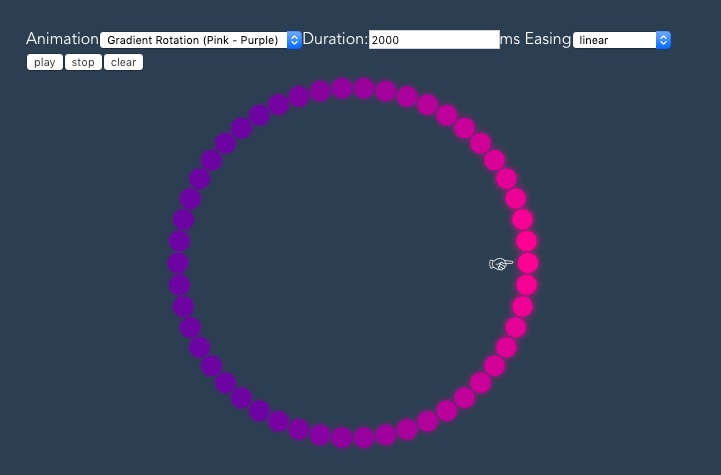

# NodeJS LED Strip Animation Framework

This framework helps to create beautiful RGB LED strip animations for strips with single accessable LEDs like APA102 or WS281x with Typescript.
It uses [tinycolor](https://github.com/bgrins/TinyColor) for color manipulation.

## Quick Start

### Prerequisites
 
1) A Raspberry Pi with the latest NodeJS (see: https://gist.github.com/marfnk/813c77e37a061418b94a0f6212ce4a2c)
2) A WS281x LED Strip with power supply
3) A 3,3V to 5V Power Converter

Connect everything like in this example: https://dordnung.de/raspberrypi-ledstrip/ws2812 (german).

### Code
```
npm install led-strip-animation --save
```

This framework comes with some built-in animations:
1) _Gradient Rotation Animation_<br>
   Creates a gradient and moves it 360° along the strip.
2) _Rainbow Animation_<br>
   Moves the color of the rainbow along the strip.
3) _Reveil Animation_<br>
   Removes a solid foreground color with a gradient tail to reveil a solid background color.
4) _Sparkle Animation_<br>
   Creates a popping of camera flashes at random places.
   
```
import { GradientRotationAnimation, LedAnimation, LedConnector, pause, RainbowAnimation, ReveilAnimation, RPiWs281xLed } from 'led-strip-animation';
import tinycolor = require('tinycolor2');

const numberOfLeds: number = 100;
const led: LedConnector = new RPiWs281xLed(numberOfLeds);

(async () => {
  // light the first, middle and last LED
  const test: tinycolor.Instance[] = Array(numberOfLeds).fill(tinycolor('black'));
  test[0] = tinycolor('blue');
  test[Math.round(numberOfLeds / 2)] = tinycolor('red');
  test[numberOfLeds - 1] = tinycolor('green');
  led.setColors(test);
  
  await pause(5000); //wait 5sec
  
  // play one of the example animations (see list above)
  const idleAnimation: LedAnimation = new GradientRotationAnimation(n, [tinycolor('red'), tinycolor('blue')]);
  await idleAnimation.play(10000, led);

})(); 
```

#### Custom Animation

If you want to create your own animation, you have to extend the abstract class `LedAnimation` and implement `getStateForProgress(p: number)`.
When the animation is running the framework repeatedly calls your class with the current progress (0..1).
This way, the animation programming is detached from the duration and easing of the animation. You can always implement a
linear animation and play it with different eases later on.

This example implements an animation that moves 1 red LED along the strip.

```
import { LedAnimation } from 'led-strip-animation';
import tinycolor = require('tinycolor2');

export class MyExampleAnimation extends LedAnimation {

  constructor(private numberOfLeds: number) {
    super();
  }

  public getStateForProgress(progress: number): tinycolor.Instance[] {
    // create an array with only black LEDs
    const result: tinycolor.Instance[] = Array(this.numberOfLeds).fill(tinycolor('black'));
    // make the LED at the position of the current progress red
    result[Math.floor(progress * this.numberOfLeds)] = tinycolor('red');

    return result;
  }

}
```

Play this animation:
```
const animation: LedAnimation = new MyExampleAnimation(100);
const duration: number = 5000; //milliseconds

//optional easing (you can also use eases from a library like https://www.npmjs.com/package/eases)
const easing: (t: number) => number = (t: number) => t; //linear easing

animation.play(duration, led, easing);
```

Since `animation.play` returns a Promise, you can easily `await` the animation:

```
console.log('animation starts');
await animation.play(duration, callback, easing);
console.log('animation has ended');
```

#### Utils

Timing Utils
```
import { pause } from 'led-strip-animation';

(async () => {
  console.log('start');
  await pause(5000); //sleep for 5sec
  console.log('end');
})(); 
``` 

Color Utils
```
import { GradientHelper } from 'led-strip-animation';
const numberOfLeds: number = 100;

//creates a gradient from an array of colors with n steps
const gradient: tinycolor.Instance[] = GradientHelper.generateGradient(numberOfLeds, [tinycolor('red'), tinycolor('orange'), tinycolor('yellow'), tinycolor('green')])
``` 

## Web Interface

You can develop the animation without any hardware and preview it in the browser.



### Setup Web Interface

1) Clone this repo
   ```
   git clone git@github.com:marfnk/led-strip-animation.git
   ```
2) build the library 
   ```
   cd led-strip-animation/lib
   npm install
   npm run build
   cd ..
   ```
3) start the preview frontend
   ```
   cd web-demo
   npm install
   npm run serve
   ```
4) open your browser at `localhost:8080`
